[![Discourse Topics][discourse-shield]][discourse-url]
[![Issues][issues-shield]][issues-url]
[![Latest Releases][release-shield]][release-url]
[![Contributor Shield][contributor-shield]][contributors-url]

[discourse-shield]: https://img.shields.io/discourse/topics?label=Discuss%20This%20Tool&server=https%3A%2F%2Fdeveloper.sailpoint.com%2Fdiscuss
[discourse-url]: https://developer.sailpoint.com/discuss/tag/workflows
[issues-shield]: https://img.shields.io/github/issues/sailpoint-oss/repo-template?label=Issues
[issues-url]: https://github.com/sailpoint-oss/repo-template/issues
[release-shield]: https://img.shields.io/github/v/release/sailpoint-oss/repo-template?label=Current%20Release
[release-url]: https://github.com/sailpoint-oss/repo-template/releases
[contributor-shield]: https://img.shields.io/github/contributors/sailpoint-oss/repo-template?label=Contributors
[contributors-url]: https://github.com/sailpoint-oss/repo-template/graphs/contributors

# Identity Fusion SaaS Connector

[Explore the docs »](https://developer.sailpoint.com/discuss/t/identity-fusion-connector/38793)

[New to the CoLab? Click here »](https://developer.sailpoint.com/discuss/t/about-the-sailpoint-developer-community-colab/11230)

There are two common challenges Identity Security Cloud (ISC) admins and source admins face when they aggregate identity data: 

1. ISC doesn't have a built-in mechanism to generate unique identifiers for identities and handle value collision. There are ways to resolve this issue, but they are complex and may require the use of external systems, which you must then maintain. 

2. ISC's typical correlation process, which involves finding an identical match based on various identity attributes, can fail and generate duplicated identities when the data isn't 100% accurate, which is common. 

The Identity Fusion SaaS Connector solves both these problems: 

- To solve the first, the connector provides an identifer template you can use to configure the generation of unique identifiers and handle value collision. 

- To solve the second, the connector provides a duplication check you can use to review identities and prevent their duplication in ISC. The connector also provides an account merging configuration that controls how it merges account attributes from different schemas and maps the account attributes to identity attributes. 

You can use these features independently or together. This document provides an overview of the fusion connector as well as a guide you can follow to [get started](#get-started). 

**Overview:** 
- [Unique ID creation](#unique-id-creation)
- [Deduplication](#deduplication)
- [Mapping and merging accounts](#mapping-and-merging-accounts)
- [Connector modes](#connector-modes)
- [Account aggregation](#account-aggregation)
- [Correlation](#correlation)

**Get started**
1. [Add fusion connector to ISC](#add-fusion-connector-to-isc)
2. [Prerequisities](#prerequisites)
3. [Create fusion connector in ISC](#create-fusion-connector-in-isc)
4. [Configure connection details](#configure-connection-details)
5. [Review and test connection](#review-and-test-connection)
6. [Configure primary source](#configure-primary-source)
    - [Base Configuration](#base-configuration)
    - [Unique ID Configuration](#unique-id-configuration)
    - [Merging/Mapping Configuration](#mergingmapping-configuration)
7. [Discover schema](#discover-schema)
8. [Create identity profile](#create-identity-profile)
    - [Create provisioning plan](#create-provisioning-plan)
9. [Aggregate entitlements](#aggregate-entitlements)
10. [Aggregate accounts](#aggregate-accounts)
11. [Add secondary sources](#add-secondary-sources)
12. [Create access profiles for deduplication](#create-access-profiles-for-deduplication)
13. [Generate deduplication report](#generate-deduplication-report)
14. [Resolve potential duplicates](#resolve-potential-duplicates)


## Unique ID creation

The fusion connector provides a template you can use to configure the generation of unique identifiers. This template offers you a simple way to, in ISC, configure typical string manipulation options, like normalizing special characters and removing spaces. This template is based on Velocity for flexibility and standardization, including the placement of the disambiguation counter. 

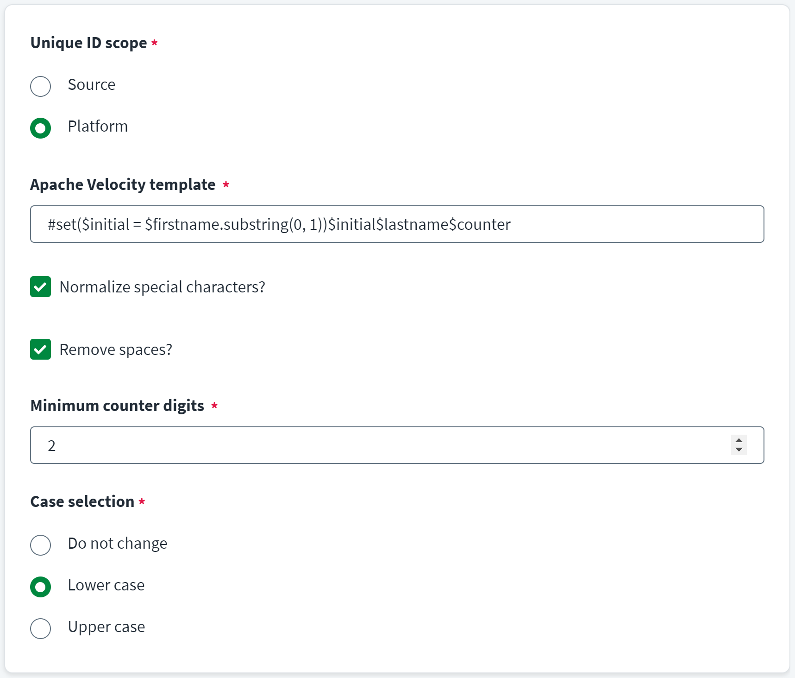

In addition to the template-based unique identifier, the connector assigns an immutable universally unique identifier (UUID) to the account, which you can synchronize with all the identity's accounts. 

https://github.com/sailpoint-oss/colab-saas-conn-identity-fusion/assets/64795004/0533792f-7f12-42a9-93d2-bb519260f0b4

This UUID also supports reevaluation, which may be necessary when infrequent changes occur, such as a surname change, which would make the previous value incorrect.

The fusion connector's identifier creation process occurs during account aggregation. When the connector creates the identifiers, the aggregation context prevents race conditions, errors that occur when multiple processes try to access the same resource at the same time. The connector reads previously aggregated accounts and compares these existing accounts to the current list to detect accounts that haven't been processed yet. 

Because the connector is deciding whether to create new accounts or update existing ones, each run starts by processing completed form instances generated by previous runs. With each run, the connector updates proxy accounts with data resulting from deduplication actions, as well as new sourec account data. 

Refer to [Unique ID Configuration](#unique-id-configuration) to learn more about how to configure the fusion connector's unique ID generation. 

## Deduplication  

The fusion connector provides a similarity check that prevents the duplication of identities. 

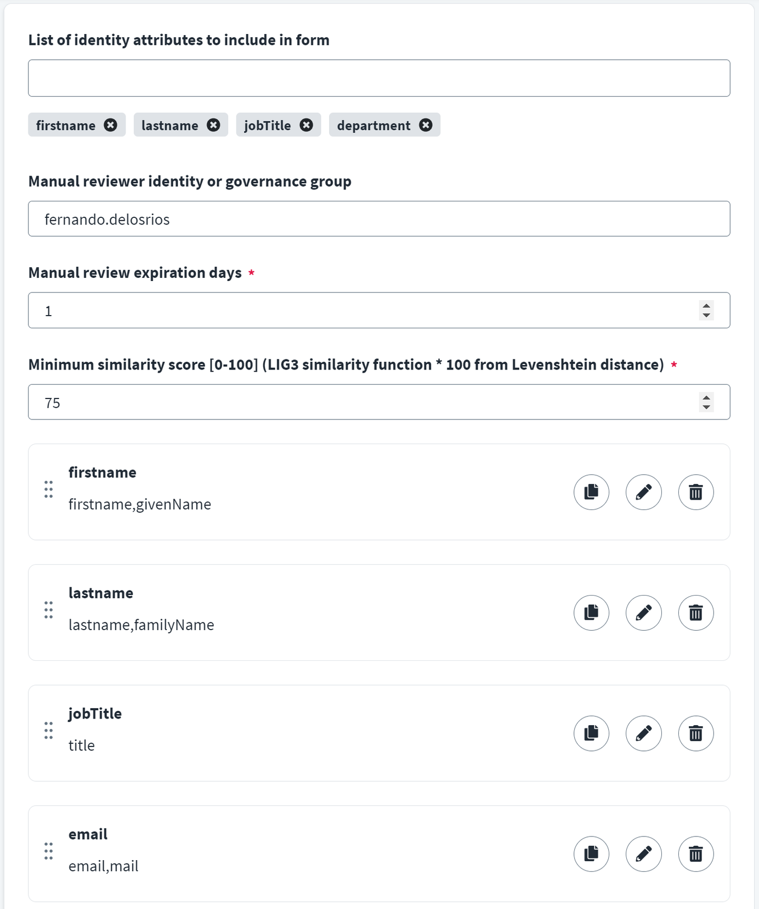

The connector checks new accounts for similarity, and if it determines the accounts are similar to one or more identities (based on a minimum similarity score), it submits the accounts for manual review to configured reviewers. The fusion connector's source is authoritative, so when it processes accounts that don't have similar existing identities, it generates new ones.

This is the deduplication process:

When the fusion connector finds a potential match, based on an attribute similarity check, it generates form instances for reviewers to check. ISC sends the reviewer an email, prompting the reviewer to check for a potential identity merge. 

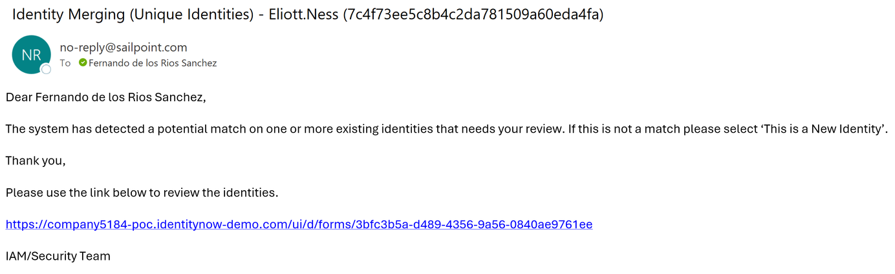

The first reviewer to complete the form decides what to do with the account: create a new identity or link it to an existing one. 

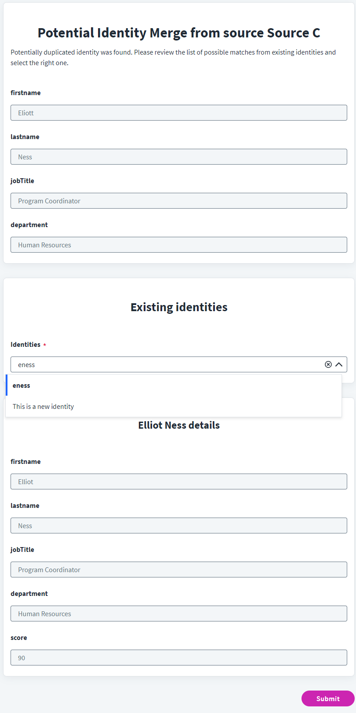

Once the reviewer makes a decision, the connector either correlates the new account with an existing identity or creates a new one, and it updates the account's history accordingly. 

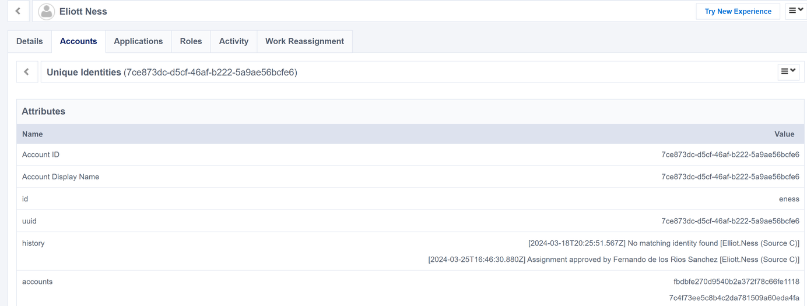

In addition to this deduplication process, you can still use conventional correlation from the original account sources. This makes the process very flexible. 

Refer to [Merging/Mapping Configuration](#mergingmapping-configuration) to learn more about how to configure this deduplication feature in the connector. 

## Mapping and merging accounts

When the fusion connector is deduplicating identities, it generates proxy accounts that result from merging account data from multiple sources. Sources may present different account schemas, so the connector can discover the account schema that results from combining the configured sources' schemas. The account merging configuration controls how account attributes map to identity attributes for comparison and also how to handle multiple accounts contributing to the same attribute. 

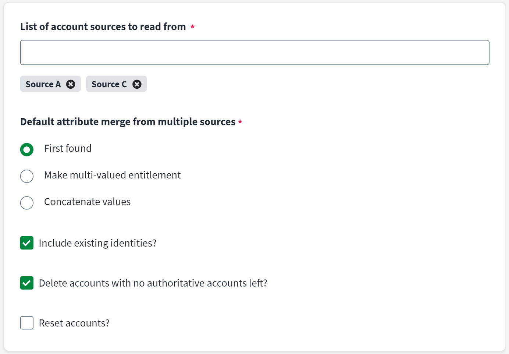

Because the connector is comparing new accounts from multiple sources with existing identities, you must map account attributes to identity attributes, which results in a combined schema from all configured sources, as well as a series of normalized attributes. 

When multiple source accounts contribute to a proxy account, there may be multiple values for the same attribute. The connector allows you to keep all values or only one. 

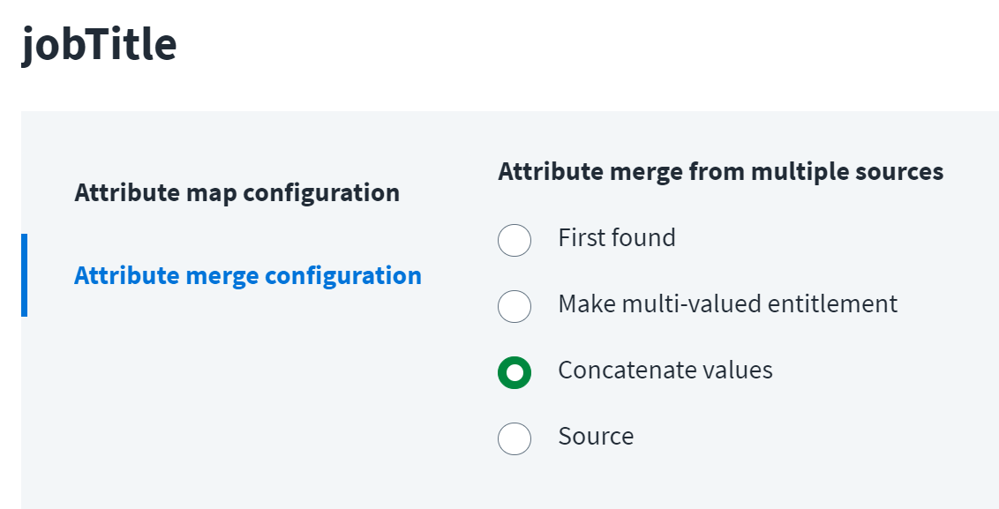

Keeping all values for an attribute can be useful in situations where multiple accounts can contribute to an identity attribute, like multiple job descriptions for the same person. You can then use these values in role assignments or searches. 

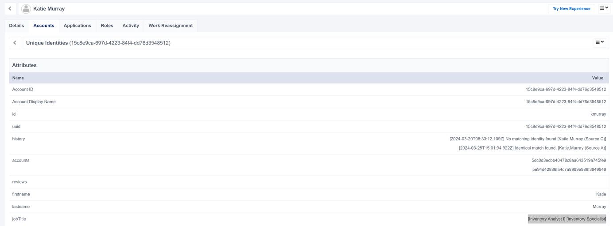 

## Connector modes

When you're configuring the fusion connector, you must first decide whether you want it to be an authoritative or regular source: 

- **Authoritative source**: An authoritative source is an organization's primary source, providing a complete list of its identities, like an HR application or Active Directory. To use deduplication, you must configure the fusion connector as an authoritative source because it's reading all the identities from a list of sources that may otherwise be authoritative sources themselves. When the connector merges account data, it creates proxy accounts, so the original accounts are not necessary to build the identity profile. The proxy accounts directly provide all account attribute data. To learn more about authoritative sources in ISC, refer to [Prioritizing Authoritative Sources](https://documentation.sailpoint.com/saas/help/setup/identity_profiles.html#prioritizing-authoritative-sources).

- **Regular source**: If you only need to generate unique identifiers and you aren't worried about duplication, you can configure the fusion connector as a regular source. When you're using the connector as a regular source, the connector uses the identifiers associated with the identity profiles linked to the sources included in the connector's configuration. When you use the connector as a regular source, you must ensure the following: 

    - All sources for the identity profiles you want to generate unique identifiers for are included in the list.

    - The 'Include existing identities' option is enabled.

    - The unique ID scope is set to 'Source'.

    - The attributes the Velocity template is using either exist in the account schema or are mapped identity attributes. 

Whether you use the fusion connector as an authoritative or regular source, the connector generates proxy accounts based on the configured sources and the the connector's other configuration options. These proxy accounts are the result of merging all source account attributes, normalized attributes based on the connector's configuration, and this set of mandatory attributes: 

- **id**: The template-based unique identifier.

- **uuid**: The immutable universally unique identifier.

- **accounts**: The list of source accounts IDs linked to the proxy account.

- **history**: The chronological history of operations performed on the account.

- **status**: The list of entitlements used as tags to identify the account's origin. 

- **reviews**: The list of pending form instances a reviewer must attend to.

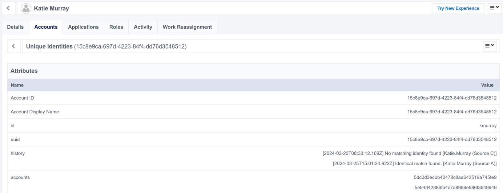

## Account aggregation 

ISC uses account aggregation to pull account data from its connected sources and update the identities correlated with those accounts. When you run an account aggregation for the first time, the fusion connector creates an account baseline. This baseline doesn't affect the creation of unique identifiers, which are always unique regardless of the batch they're created on, but it's essential for deduplication, which requires a list of identities to compare incoming account data to. You can add more sources to the configuration, and the connector will compare account data from those sources with this baseline. 

When the connector creates new proxy accounts, it returns them as 'disabled'. It disables the accounts by default because the connector is an authoritative source. This means that when it creates new identities for new accounts, the identities don't exist, so it cannot correlate them yet. Disabling the accounts allows you to quickly correlate the proxy accounts with their source accounts. The best practice is to configure the identity profile so it automatically enables proxy accounts, triggering correlation with their source accounts. Alternatively, the next account aggregation will run any pending account correlations. 

Disabling an account triggers a template-based unique identifier reevaluation. It's recommended that you configure the 'UUID' as the account's 'native identity' and 'name'. UUID works well as a native identity because native identities cannot be changed, and it works well as a name because the account name must not change if you want to keep the identity. 

**Note**: You can reenable or reaggregate a disabled account so it appears enabled. 

You can find a diagram of the fusion connector's aggregation process here: [Account aggregation process diagram](https://miro.com/app/board/uXjVNgEpRGs=/)

## Correlation

The fusion connector's correlation configuration depends on whether you are using the connector as an authoritative or regular source: 

- **Authoritative source**: When you use the connector as an authoritative source, reviewer accounts always get the identity’s UID as unique identifier. Therefore, when you use deduplication, you must set correlation between an identity’s UID and the account’s ID.

- **Regular source**: To correlate proxy accounts directly with corresponding identities, you must identify the account attributes the connector can match with identity attributes. This configuration depends on the actual data, and it's the same as any other source account correlation. 

## Get started 

To configure the fusion connector in ISC, read these sections in order: 

1. [Add fusion connector to ISC](#add-fusion-connector-to-isc)
2. [Prerequisities](#prerequisites)
3. [Create fusion connector in ISC](#create-fusion-connector-in-isc)
4. [Configure connection details](#configure-connection-details)
5. [Review and test connection](#review-and-test-connection)
6. [Configure primary source](#configure-primary-source)
    - [Base Configuration](#base-configuration)
    - [Unique ID Configuration](#unique-id-configuration)
    - [Merging/Mapping Configuration](#mergingmapping-configuration)
7. [Discover schema](#discover-schema)
8. [Create identity profile](#create-identity-profile)
    - [Create provisioning plan](#create-provisioning-plan)
9. [Aggregate entitlements](#aggregate-entitlements)
10. [Aggregate accounts](#aggregate-accounts)
11. [Add secondary sources](#add-secondary-sources)
12. [Create access profiles for deduplication](#create-access-profiles-for-deduplication)
13. [Generate deduplication report](#generate-deduplication-report)
14. [Resolve potential duplicates](#resolve-potential-duplicates)

### Add fusion connector to ISC

Before you configure the fusion connector and use it, you must first get the fusion connector and upload it to your ISC tenant. Follow these steps to do so: 

1. Download the SaaS Identity Fusion Connector zip file from its [Colab topic](https://developer.sailpoint.com/discuss/t/identity-fusion-connector/38793). 

2. Download the SailPoint CLI if you haven't already. You can find instructions for how to download the CLI and set it up in [Get the CLI](https://developer.sailpoint.com/docs/tools/cli). 

3. Use the CLI to create an empty connector project that will house your fusion connector zip file. To do so, run this command: 

    ```
    sail conn create connector-name
    ```

    Once you have successfully created the project, the CLI will display the new connector project, along with its ID. 
    
    You will need this ID to upload your fusion connector zip file to the project. 

    This is what a successful response would look like: 
    ```
    +--------------------------------------+--------------------+
    |                  ID                  |       ALIAS        |
    +--------------------------------------+--------------------+
    | connector-id                         | connector-name     |
    +--------------------------------------+--------------------+
    ```

    If you lose track of the connector project's ID, you can use the CLI to find it in a list of the organization's available connectors. To view this list, run this command: 

    ```
    sail conn list 
    ```

    To learn more about creating and uploading connectors to ISC, refer to [Test, Build, and Deploy](https://developer.sailpoint.com/docs/connectivity/saas-connectivity/test-build-deploy).

4. Use the CLI to upload the fusion connector zip file to the empty connector project. To do so, run this command: 

    ```
    sail conn upload -c connector-id -f filepath/fusion-connector-zip-filename.zip 
    ```

    Once you have successfully uploaded the connector zip file to the project, the CLI will display the new connector ID and its version. 

    This is what a successful response would look like: 

    ```
    +--------------------------------------+---------+
    |             CONNECTOR ID             | VERSION |
    +--------------------------------------+---------+
    | connector-id                         |       1 |
    +--------------------------------------+---------+
    ```

Once you have uploaded the fusion connector to the project, you will be able to find it in ISC. 

### Prerequisites 

Before you can configure the fusion connector, you must ensure the following: 

- The sources you want to aggregate account data from are already configured. 
- ISC has already aggregated account data from those sources. 

To learn how to configure sources and aggregate source account data in ISC, refer to [Loading Account Data](https://documentation.sailpoint.com/saas/help/accounts/loading_data.html). 

### Create fusion connector in ISC

Once you have uploaded the fusion connector to ISC, you can configure it. The first step to configuring the connector is creating a source for it in ISC. To do so, follow these steps: 

1. Log in to your ISC tenant and go to 'Admin' > 'Connections' > 'Sources'. 
2. Select 'Create New'. Doing so opens a list of available connectors you can use to create your source. 
3. Find your fusion connector by its name and select 'Configure'. 
4. Specify a 'Source Name', provide a 'Source Description', and select a 'Source Owner' from the list. This list includes all identities in your tenant. 
5. Make sure you check the box for 'Authoritative Source'. The fusion connector must be an authoritative source to be able to create a baseline of identities it can check accounts against for duplicates. 
6. Select 'Continue' to save your changes and continue to the fusion connector's configuration. 

Once you have completed these steps, the connector creation form will look something like this: 

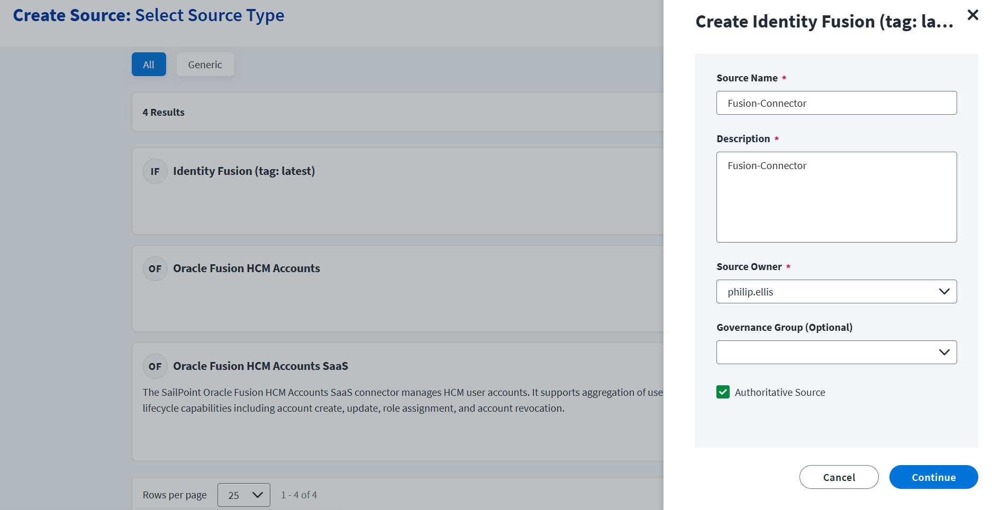

To learn more about the process of creating connectors, refer to [Configuring a Source](https://documentation.sailpoint.com/saas/help/accounts/loading_data.html#configuring-a-source). 

**Note**: Do not create multiple fusion connectors that connect to the same sources. Doing so may cause accounts to get missed during aggregation. 

### Configure connection details 

The fusion connector must be able to connect to the ISC APIs to be able to read its data and make changes in ISC. To enable these connections, you must configure the connector's 'Connection Details': 

1. **Identity Security Cloud API URL**: Specify the ISC API URL your connector will send requests to. Your ISC API URL will be something like this: https://{tenant}.api.identitynow.com 

2. **Personal Access Token ID**: Provide your personal access token (PAT) client. PATs allow you to authenticate to the ISC APIs and prove that you are someone who is allowed to access them. To learn how to create a PAT, refer to [Generate a personal access token](https://developer.sailpoint.com/docs/api/v2024/authentication#generate-a-personal-access-token). 

3. **Personal Access Token secret**: Provide your PAT client secret. The PAT secret is a value that adds an additional layer of security.

4. Select 'Save' to save your changes and continue. 

Once you have completed the connection details, it will look something like this: 

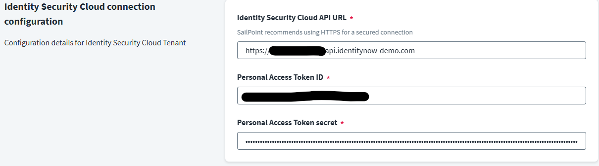

### Review and test connection

Once you have configured the connection details, you can test the connection. To do so, go to the 'Review and Test' section and select 'Test Connection'. ISC will use the URL and credentials you provided to connect to the ISC APIs. When it's successful, it will display a message indicating that the connection was successful. 

### Configure primary source

Once you know the fusion connector can connect to the ISC APIs, you can start configuring the connector's primary source. This primary source builds the baseline for all the identities the connector will compare other secondary source accounts to. To configure the primary source, go to the 'Configuration' section. 

The 'Configuration' section includes three parts you must configure: 

1. [Base Configuration](#base-configuration): This section includes details like which source you want to read account data from, how to handle the account data it finds, and some other useful options you can set for the connector.

2. [Unique ID Configuration](#unique-id-configuration): This section determines how you want the fusion connector to generate unique IDs from the source accounts it reads, as well as the scope for that process. 

3. [Merging/Mapping Configuration](#mergingmapping-configuration): This section determines how you want to map and merge account attributes. Mapping involves matching source account attributes with identity attributes so that ISC can recognize those attributes. Merging determines how the fusion connector will handle multiple values for the same account attributes for accounts from multiple sources. Merging also includes a similarity check you can apply to prevent the creation of duplicate identities. 

#### Base Configuration 

The first step to configuring your fusion connector is to set up its base configuration. This configuration determines which sources you want to read account data from, how to handle the account data it finds, and some other useful options you can set for the connector. You will first configure your primary source and then you will add secondary sources the fusion connector will also read from. 

To configure your primary source, provide these details: 

1. **List of account sources to read from**: Specify the account source you want to read from and click 'Enter' to add the source to the list. You will start with the primary source you want to use as a baseline. Once you completely configure the primary source and aggregate its account data with the fusion connector, you can add additional sources to this list. 

2. **Default attribute merge from multiple sources**: Select an option to determine how you want to merge account attributes from multiple sources: 

     - **First found:** The connector uses the first value it finds for an account, based on the set source order, to populate the account attribute.

    - **Make multi-valued entitlement:** The connector creates a list of unique values from all accounts contributing to the account attribute.

    - **Concatenate values:** The connector creates a concatenated string of unique values, enclosed in square brackets, from all accounts contributing to the same account attribute.

3. You can enable these optional settings: 

    - **Delete accounts with no authoritative accounts left?**: This option determines whether the connector deletes the proxy account when there are no linked accounts remaining. 

    - **Reset accounts?**: Use this option to reset current accounts from the source.

    - **Force source aggregation?**: Use this option to force an account aggregation from the source. This means that whenever you aggregate account data with the fusion connector, the connector will first aggregate data from the source itself. 

Once you have completed the base configuration, it will look something like this: 

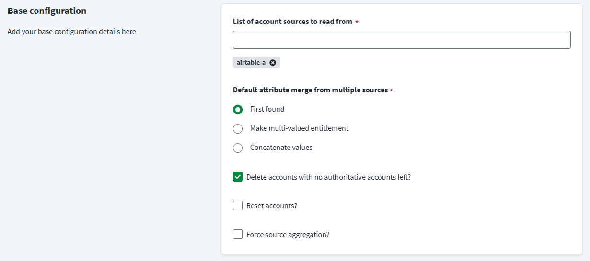

#### Unique ID Configuration

The next step to configuring the fusion connector is to set up its unique ID configuration. This configuration determines how the connector generates unique identity IDs for the source accounts it aggregates. 

To configure unique ID generation, provide these details: 

1. **Unique ID scope**: Enable one of these options to determine the scope for the connector's unique ID generation:

    - **Source**: The connector only considers source accounts when it calculates unique IDs.

    - **Platform**: The connector considers both source account IDs and all ISC identities' UIDs when it calculates unique IDs.

2. **Apache Velocity template**: Specify the template the connector will use to generate unique IDs from incoming source account data. The Apache Velocity context is based on the account attributes. It's best to use normalized, attributes. Make sure the fields you reference in the velocity template exist in your source or in the mapping configuration you will provide in the [Merging/Mapping Configuration](#mergingmapping-configuration). 

3. You can enable these optional settings: 

    - **Normalize special characters?**: The connector removes special characters and quotes. This option is recommended. 

    - **Remove spaces?**: The connector removes spaces from the source account data. 

4. **Minimum counter digits**: Specify the the zero-based padding the connector will add to the disambiguation counter. 

5. **Case selection**: Select one of these options to determine how the connector cases incoming strings: 

    - **Do not change**: The connector doesn't make any changes to incoming strings' casing. 

    - **Lower case**: The connector changes incoming strings to lower case. 

    - **Upper case**: The connector changes incoming strings to upper case. 

Once you have completed these steps, your configuration will look something like this: 

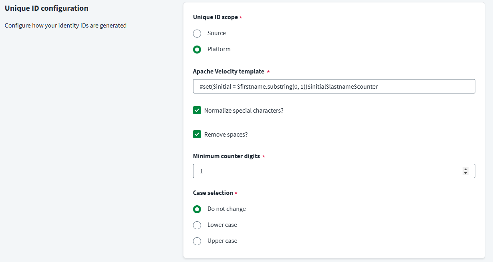

In most cases, your configuration will be similar to the one in this screenshot, but your velocity template may be different. Ensure that the fields the velocity template references exist in the source or in the mapping configuration you provide. 

#### Merging/Mapping Configuration

The next step to configuring the fusion connector is to set up merging and mapping for the incoming source account attributes. When you aggregate account data from different sources, that data will often be stored in different formats from the format ISC uses for your identity data. To standardize the attribute data between ISC identities and their correlated source accounts, you must configure how the connector maps account attributes to identity attributes. 

Additionally, the fusion connector can actually merge incoming source account data. For example, if an identity has two accounts on two different sources with two different departments, you may want to include both departments in a concatenated list.

To configure merging and mapping, provide these details: 

1. **Enable account merging?**: If you enable this option, the connector merges incoming source account data based on your specifications. This is an optional setting. 

2. **List of identity attributes to include in form**: Specify the identity attributes you want to map source account attributes to and click 'Enter' to add them to the form. This list is optional - it's possible that your source account attributes completely match your ISC identity attributes. 

3. **Manual review expiration days**: Specify a number here to determine how long reviewers will have to review potential duplicates. This number is required. 

4. **Use overall merging score for all attributes?**: The fusion connector uses a merging score, or minimum similarity score, to determine whether a source account may result in a potential duplicate identity. If you enable this option, you can specify the merging score to use for all account attributes. If you don't enable this option, you will be able to specify different merging similarity scores for different account attributes. 

    - **Minimum similarity score [0-100] (LIG3 similarity function * 100 from Levenshtein distance)**: If you enable the 'use overall merging score' option, this field will display. The idea is that a score of 0 means the two attributes are completely different, and 100 means the two are completely identical. You can specify the minimum score that must be met for the fusion connector to initiate a review for potential duplicates. 

5. **Add attribute mapping(s)**: Add the source account attributes you want to potentially map to identity attributes in ISC. These attribute mappings depend on the source account attributes themselves, and you must decide which ones you want to map to identity attributes in ISC. 

    - **Attribute map configuration**: When you add a mapping, you must provide these details:

        - **Identity attribute**: This is the ISC identity attribute you want to compare account attributes to. 

        - **Account attributes**: These are the account attributes you want to compare to the ISC identity attribute. You can specify the same account attribute in multiple different ways, depending on how they're formatted in their sources. For example, you can map both 'email' and 'Email' account attributes to the one 'email' identity attribute. 

        - **Use mapping for unique ID generation only**: This is an optional setting you can use to ensure that the mapping is NOT used for merging but only for unique ID generation. You would enable this setting if you didn't want to merge account data for these attributes. 

    The mapping configuration will look something like this: 

    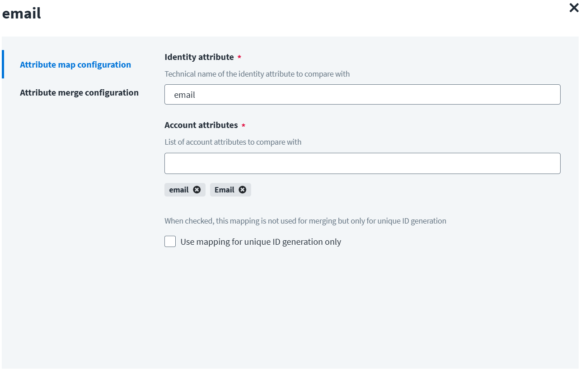
    
    - **Attribute merge configuration**: Provide these details for each attribute that you want to merge: 

        - **Attribute merge from multiple sources**: Select an option to determine how you want to merge account attributes from multiple sources: 

            - **First found:** The connector uses the first value it finds for an account, based on the set source order, to populate the account attribute.

            - **Make multi-valued entitlement:** The connector creates a list of unique values from all accounts contributing to the account attribute.

            - **Concatenate values:** The connector creates a concatenated string of unique values, enclosed in square brackets, from all accounts contributing to the same account attribute. 

        - **Minimum similarity score [0-100] (LIG3 similarity function * 100 from Levenshtein distance)**: If you do not enable the 'Use overall merging score for all attributes?' option, you must specify the minimum score for each attribute you want to merge. This is the minimum score that must be met for the fusion connector to initiate a review for potential duplicates. The idea is that a score of 0 means the two attributes are completely different, and 100 means the two are completely identical. 
        
        The merging configuration will look something like this: 
        
        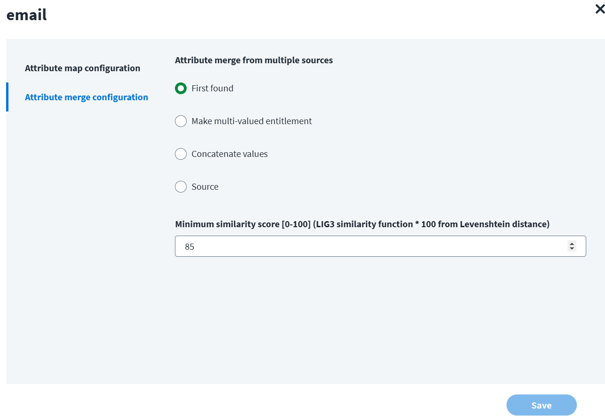

Once you have completed your overall merging/mapping configuration, it will look something like this: 


In this example, there are two 'email' fields ('email' and 'Email') from the two sources you want to aggregate data from, two 'department' fields ('dept' and 'department'), and a 'display name' field ('displayName'). Because an email and a display name should be the same for a source account and its correlated identity in ISC, the connector will only use the 'email' and 'displayName' fields for duplication detection. 

However, a source account may have multiple departments correlated with the same identity, so the connector will concatenate the 'department' fields into one field. This way, you can easily see incoming departments from both sources in the form of a concatenated list. You can also combine fields into one to use the field for the velocity template and unique ID configuration. 

### Discover schema

Each source has an account schema, or set of account attributes that accounts on the source can have. For sources whose schema are discoverable, ISC connectors can discover these schema and read these attributes. The fusion connector supports discovering source account schema. The connector can even build this schema for multiple sources by merging the multiple configured sources' schemas. 

To discover a source's account schema, run 'Discover Schema' in the 'Account Schema' section. When the fusion connector discovers the source schema, it pulls in the account schema from the primary source. This account schema will include the attributes you mapped, as well as others you may have decided didn't need mapping and/or potential merging. To learn more about source account schema and schema discovery, refer to [Managing Account Schemas](https://documentation.sailpoint.com/saas/help/accounts/schema.html).

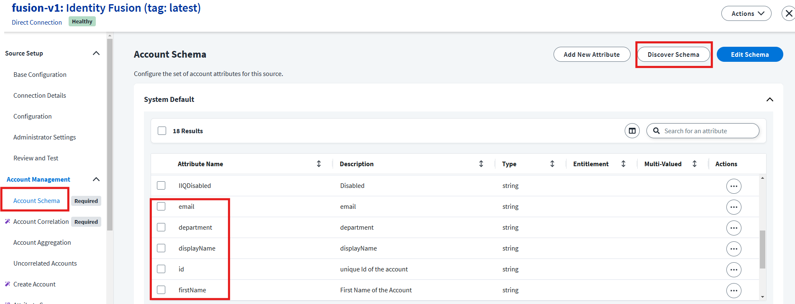

In this example, the connector found the attributes that need mapping and potential merging ('email', 'department', and 'displayName'), as well as several others that don't ('IIQDisabled', 'id', 'firstName').

**Note**: Depending on the attribute merge configuration, the connector may return some attributes as multi-valued entitlements. If you're changing the attribute merge settings and your changes may result in changes to multi-valued attributes after the first schema discovery, you must review your schema and change it accordingly (ISC doesn't do this for you). You can also remove optional schema attributes to prevent the connector from fetching undesired data. 

### Create identity profile

In ISC, identity profiles allow you to preconfigure the identity attributes you want to create or map from source account attributes when you create an identity. Before you can use the fusion connector to aggregate source account data into ISC, you must set up the fusion connector's identity profile so ISC can determine how to create identities from the connector's incoming account data. 

Follow these steps to create the identity profile for the fusion connector: 

1. Create an identity profile for the fusion connector and set the mappings according to the fields the connector is creating. To learn how to create an identity profile, refer to [Creating Identity Profiles](https://documentation.sailpoint.com/saas/help/setup/identity_profiles.html). 

2. There is a special transform the fusion connector creates in ISC that you must use to update the lifecycle state. You must set configure the 'Lifecycle State' mapping in the way shown in this screenshot. 

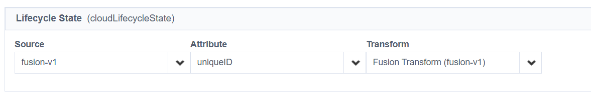

#### Create provisioning plan

Within identity profiles in ISC, you can create provisioning plans, which determine what access the created identities will have and whether they'll be enabled or disabled. For the fusion connector's transform to take effect, you must create a provisioning plan called "Staging". This provisioning plan ensures that when the connector creates new accounts, the accounts are immediately created. Without this provisioning plan, ISC would need to run the accounts through aggregation twice before creating them. 

To create the provisioning plan, follow these steps: 

1. Within the identity profile you created, create a provisioning plan called "Staging". 

2. Enable the provisioning plan. 

3. Choose the 'Configure Changes' option in the 'Settings for Previous Accounts' section. 

4. Choose the 'Enable Accounts' option in the 'Account Configuration Options' section. 

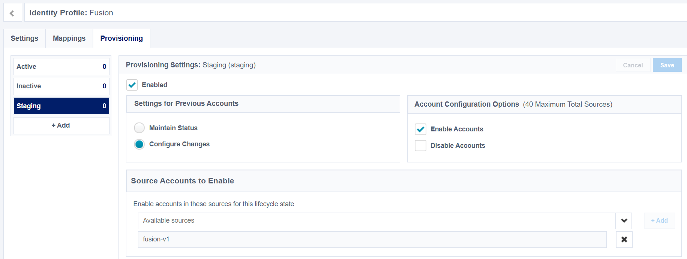

### Aggregate entitlements

In ISC, entitlements refer to the access rights an account has on a source. Once you have created the identity profile and the provisioning plan, you can aggregate entitlements from the primary source. To do so, return to the fusion connector's configuration and go to the 'Entitlement Aggregation' section. Select 'Start Aggregation' to aggregate the entitlements. 

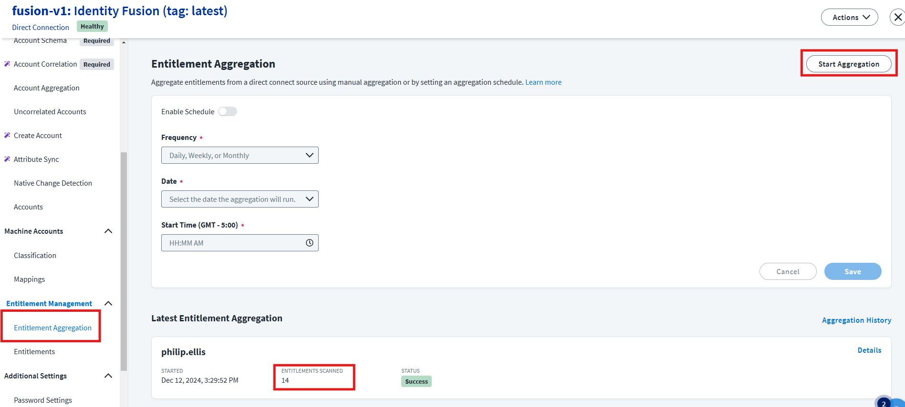

When your entitlement aggregation is successful, the 'Latest Entitlement Aggregation' section populates with the timestamp of the aggregation, the number of entitlements scanned, and a status of 'Success'. You can then see the aggregated entitlements in the 'Entitlements' section. 


When you run an entitlement aggregation, the fusion connector connector populates all the different statuses with descriptions.

To learn more about entitlements and entitlement aggregation, refer to [Loading Entitlements](https://documentation.sailpoint.com/saas/help/setup/load_entitlements.html). 

### Aggregate accounts 

You can now aggregate the source accounts. To do so, go to the 'Account Aggregation' section. Select 'Start Aggregation' to aggregate the accounts. 

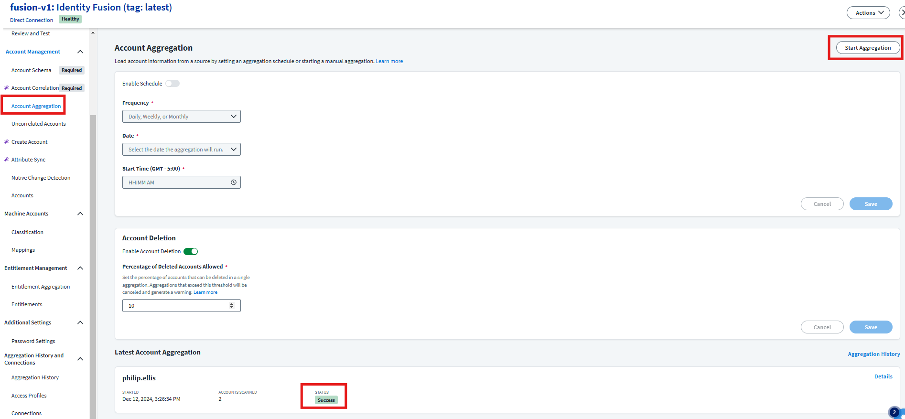

When your account aggregation is successful, the 'Latest Account Aggregation' section populates with the timestamp of the aggregation, the number of accounts scanned, and a status of 'Success'. You can then see the aggregated accounts in the 'Accounts' section. 

To learn more about account aggregation, refer to [Loading Account Data](https://documentation.sailpoint.com/saas/help/accounts/loading_data.html). 

### Add secondary sources

Now that you can aggregate account data from your primary source, you can add secondary sources that the fusion connector can also read from, and if it finds similar account attributes, merge that source account data. 

To add secondary sources, follow the same steps you used to configure the primary source. You would start by adding them to the 'List of account sources to read from' in the fusion connector's base configuration. 

With each source you add, first make sure that you have already aggregated their accounts. Then make sure you discover their account schema and aggregate their entitlements. 

### Create access profiles for deduplication

In ISC, access profiles are bundles of entitlements representing sets of access from a single source. To configure the fusion connector's deduplication functionality, you must create some access profiles. Go to 'Access Profiles' to get started. 

First, create an access profile called 'Fusion Report'. ISC will request this access profile whenever you want to display a report that shows incoming identities and their potential matches with other existing identities in ISC. To configure the report, you must add the 'Fusion report' entitlement to the access profile. 

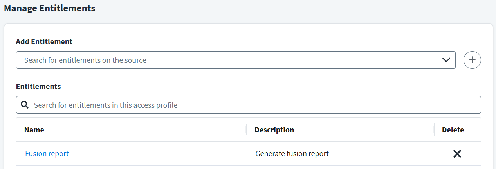

Next, you must add an access profile for each source that uses the fusion connector. For each access profile you add, add an entitlement for each source and name the entitlement "(source name) reviewer". When someone has access to this entitlement, ISC will notify and email that person to serve as a reviewer when the fusion connector detects a potential duplicate identity for that source. 


To learn more about access profiles and how to configure and manage them, refer to [Managing Access Profiles](https://documentation.sailpoint.com/saas/help/access/access-profiles.html). 

### Generate deduplication report

You may actually want to generate a report to detect potential duplicate accounts before you even run an aggregation. To do so, request access to the 'Fusion Report' access profile. To learn more about requesting access, refer to [Working with access requests](https://documentation.sailpoint.com/saas/user-help/requests/request_center.html). 

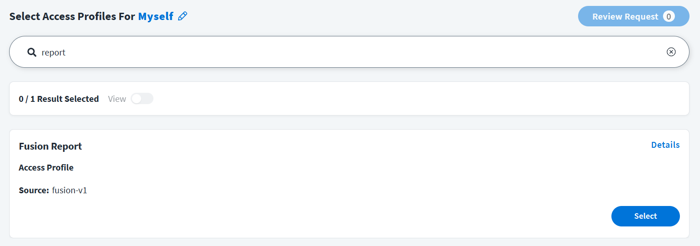

Once you have access to the access profile, ISC will send you an email listing any potential duplicate accounts and their potential matching identities in ISC when the connector finds them. 

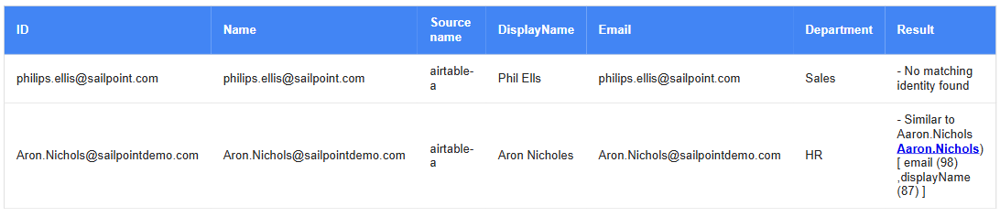

### Resolve potential duplicates

When an aggregation event occurs on the fusion connector, it compares all new accounts from all child sources to all identities in ISC. If it finds any duplicates, it creates a form, assigns all the reviewers to the source, and sends the reviewers that form. The form provides reviewers with the option to update the identity's attributes and select whether the account is a new identity or a duplicate of an existing one. 

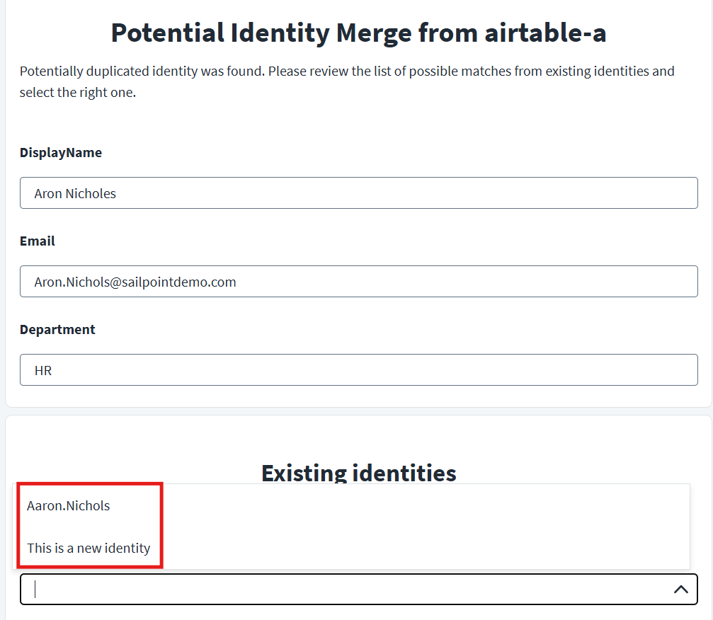

Once the first reviewer resolves the potential duplicate, the connector creates the account during its next aggregation cycle. 

## Contributing

Contributions are what make the open source community such an amazing place to learn, inspire, and create. Any contributions you make are **greatly appreciated**.

If you have a suggestion that would improve this project, please fork the repo and create a pull request. You can also open an issue with the tag `enhancement`.
Don't forget to give the project a star! Thanks again!

1. Fork the Project
2. Create your Feature Branch (`git checkout -b feature/AmazingFeature`)
3. Commit your Changes (`git commit -m 'Add some AmazingFeature'`)
4. Push to the Branch (`git push origin feature/AmazingFeature`)
5. Open a Pull Request

<!-- LICENSE -->

## License

Distributed under the MIT License. See `LICENSE.txt` for more information.

<!-- CONTACT -->

## Discuss

[Click Here](https://developer.sailpoint.com/dicuss/tag/{tagName}) to discuss this tool with other users.